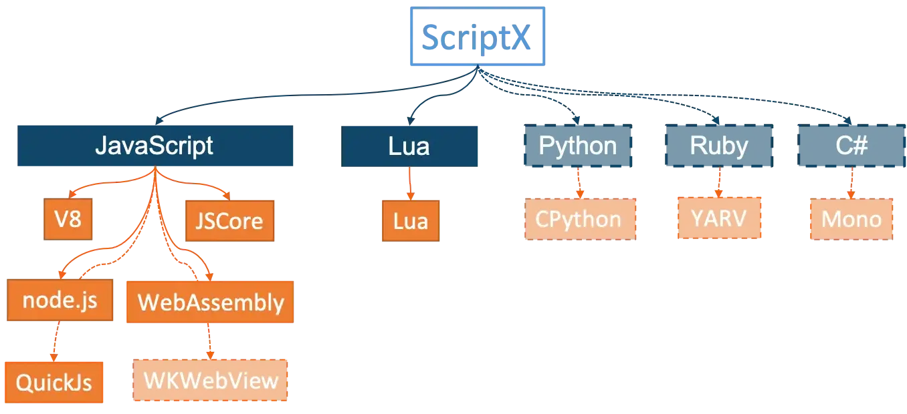

</img>

<h2>ScriptX</h2>
<p>全能的脚本引擎抽象层</p>

---
[](README.md) [](https://www.apache.org/licenses/LICENSE-2.0) [](https://github.com/Tencent/ScriptX/actions/workflows/unit_tests.yml)     [](https://coveralls.io/github/Tencent/ScriptX)




ScriptX是一个脚本引擎抽象层。对下封装多种脚本引擎，对上暴露统一的API，使得上层调用者可以完全隔离底层的引擎实现(后端)。

ScriptX不仅隔离了几种JavaScript引擎，甚至可以隔离不同脚本语言，使得**上层仅需修改一个编译选项即可无缝切换脚本引擎和脚本语言**。

ScriptX的术语中，"前端"指对外的C++ API，"后端"则指不同的底层引擎，目前已经实现的后端有：V8, node.js, JavaScriptCore, WebAssembly, Lua.

# 简介

ScriptX 的接口使用现代C++特性。并且做到100%符合C++标准，完全跨平台。

所有API以`ScriptX.h`聚合头文件暴露出来。

设计目标： **多语言** | **多引擎实现** | **高性能** | **API易用** | **跨平台**

# 第一印象

我们通过一段比较完整的代码来对ScriptX留下一个整体印象。

```c++
EngineScope enter(engine);
try {
  engine->eval("function fibo(x) { if (x<=2 ) return 1; else return fibo(x-1) + fibo(x-2) }");
  Local<Function> fibo = engine->get("fibo").asFunction();
  Local<Value> ret = fibo.call({}, 10);
  ret.asNumber().toInt32() == 55;

  auto log = Function::newFunction(
      [](const std::string& msg) {
        std::cerr << "[log]: " << msg << std::endl;
      });
  // or use: Function::newFunction(std::puts);
  engine->set("log", log);
  engine->eval("log('hello world');");

  auto json = engine->eval(R"( JSON.parse('{"length":1,"info":{"version": "1.18","time":132}}'); )")
                  .asObject();
  json.get("length").asNumber().toInt32() == 1;

  auto info = json.get("info").asObject();
  info.get("version").asString().toString() ==  "1.18";
  info.get("time").asNumber().toInt32() == 132;

  Local<Object> bind = engine->eval("...").asObject();
  MyBind* ptr = engine->getNativeInstance<MyBind>(bind);
  ptr->callCppFunction();

} catch (Exception& e) {
  FAIL() << e.message() << e.stacktrace();
  // or FAIL() << e;
}
```

1. 使用 `EngineScope` 进入引擎环境
2. 绝大多是API可以接受C++原生类型作为参数，内部自动转换类型
3. 可以从C/C++函数直接创建脚本函数（native 绑定）
4. 支持脚本的异常处理
5. API强类型

# 特性介绍

## 1. 支持多种引擎，多脚本语言
ScriptX设计之初就目标为支持多种脚本语言，并在JavaScript上实现了V8和JavaScriptCore的引擎封装。
后续为了验证ScriptX的多语言设计，实现了完整的Lua绑定。
目前针对WebAssembly的支持也已经完成。

## 2. 现代的 C++ API

API设计上符合现代 C++ 风格，如：
1. 三种引用类型 Local/Global/Weak，使用copy, move语义实现自动的内存管理（自动引用计数）
2. 使用 variadic template 支持非常方便的 Function::call 语法
3. 使用 Template Meta-Programing 实现直接绑定C++函数

现代语言特性，引用空指针安全（nullibility safety 请参考kotlin的概念）。

> 注：ScriptX要求C++17（或1z）以上的编译器支持，并需要打开异常特性，（可以关闭RTTI特性）。

## 3. 高性能
高性能是ScriptX设计上的重要指标。在实现过程中也充分体现了 Zero-Overhead 的C++思想。并在增加功能特性的时候通过相关的性能测试。


测试指标：单次JS到C++函数调用耗时，微秒

测试环境：iMac i9-9900k 32G RAM @macOS 10.15

性能测试表示，在Release模式下，ScriptX可以达到几乎和原生绑定相同的性能。（由于ScriptX使用大量模板，请勿在Debug版进行性能测试）

## 4. 方便的异常处理

ScriptX通过一系列的技术手段实现了脚本的异常和C++异常相互打通的能力。在调用引擎API时无需判断返回值，可以使用异常统一处理，避免crash。

比如使用者可以在C++层catch住js代码抛的异常，并获取message和堆栈；也可以在native函数里抛一个C++异常(`script::Exception`) 并透传到js代码中去。

详见 [ExceptionTest](test/src/ExceptionTest.cc) 及 [相关文档](docs/zh/Exception.md)

## 5. 易用的API

> 易用的API => 开心的工程师 => 高效 => 高质量

ScriptX 设计的时候充分考虑到API的易用性，包括操作友好简单，不易出错，错误信息明显，便于定位问题等。在这样的指导思想之下ScriptX做了很多原生引擎做不了的事情。

比如：V8在destory的时候是不执行GC的，导致很多绑定的native类不能释放。ScriptX做了额外的逻辑处理这个情况。

V8和JSCore要求在finalize回调中不能调用ScriptX的其他API，否则会crash，这也导致代码逻辑很难实现。ScriptX借助MessageQueue完美规避这个问题。

V8和JSCore的全局引用都必须在engine destory之前全部释放掉，否则就会引起crash、不能destory等问题。ScriptX则保证在Engine destory的时候主动reset所有 Global / Weak 引用。

## 6. 简单高效的绑定API

当app作为宿主使用脚本引擎时，通常都是需要注入大量native 绑定的 函数/类 来为脚本逻辑提供能力。ScriptX 设计的`ClassDeifine`相关绑定API简单易用，并且可以支持直接绑定C++函数，极大的提升工作效率。

## 7. 可以与原生引擎API互操作
ScriptX再提供引擎封装的同时，也提供了一套工具方法实现原生类型和ScriptX类型的相互转换。

详见 [InteroperateTest](test/src/InteroperateTest.cc) 及 [相关文档](docs/zh/Interop.md)

# 代码质量

代码质量高标准要求
1. 上百个测试用例，**单测覆盖率达 90+%**
2.  **圈复杂度仅有 1.18**。
3. 借助clang-format保证代码格式统一。
4. 使用clang-tidy发现潜在问题。
5. 在clang和MSVC编译器上都打开了"warning as error"级别的错误信息。

# 代码目录结构

```text
root
├── README.md
├── src
│   ├── Engine.h
│   └── ...
├── backend
│   ├── JavaScriptCore
│   ├── Lua
│   ├── Python
│   ├── QuickJs
│   ├── Ruby
│   ├── SpiderMonkey
│   ├── Template
│   ├── V8
│   ├── WKWebView
│   └── WebAssembly
├── docs
│   ├── Basics.md
│   └── ...
└── test
    ├── CMakeLists.txt
    └── src
        ├── Demo.cc
        └── ...
```

1. `src`: 对外API，主要是头文件
2. `backend`: 各种引擎后端的实现
3. `docs`: 丰富的文档
4. `test`: 各种单元测试

# 上手文档

ScriptX 中的一些重要类：
1. `ScriptEngine`
2. `EngineScope`
2. `Exception`
3. `Value`, `Null`, `Object`, `String`, `Number`, `Boolean`, `Function`, `Array`, `ByteBuffer`, `Unsupported`
4. `Local<Value>`, `Local<Null>`, `Local<Object>`, `Local<String>`, `Local<Number>`, `Local<Boolean>`, `Local<Function>`, `Local<Array>`, `Local<ByteBuffer>`, `Local<Unsupported>`
5. `Global<T>`, `Weak<T>`

在正式使用ScriptX之前，请花半个小时**仔细阅读**下列文档，并熟悉 ScriptX 中的若干概念。

1. [CMake项目引入指引](docs/zh/ImportScriptX.md)
2. [基本概念](docs/zh/Basics.md) 这部分比较重要
    1. 约定
    1. 预定义宏
    1. Engine 与 MessageQueue
    1. Scope
    1. Value
    1. Local
    1. Global / Weak
3. [异常处理](docs/zh/Exception.md)
4. [C++绑定](docs/zh/NativeBinding.md)
    1. 创建一个Native的Function
    2. defineClass
    1. ScriptClass
    3. 各种操作
    4. 直接绑定C++函数
    5. converter
    6. 对现有C++类的绑定
    7. Tips: 选择重载函数
    8. Tips: 不同语言见的差异
5. [和原生引擎API的互操作](docs/zh/Interop.md)
    1. `script::v8_interop`
    1. `script::jsc_interop`
    1. `script::lua_interop`
6. [JavaScript语言说明](docs/zh/JavaScript.md)
    1. 类型对照表
7. [Lua语言说明](docs/zh/Lua.md)
8. [WebAssemble说明](docs/zh/WebAssembly.md)
9. [node.js说明](docs/zh/NodeJs.md)
9. [常见问题](docs/zh/FAQ.md)
10. [快速体验指南](docs/zh/QuickStart.md)
11. [性能相关](docs/zh/Performance.md)
12. [ScriptX在 2020年 Pure C++大会](docs/zh/PureCpp2020.md)